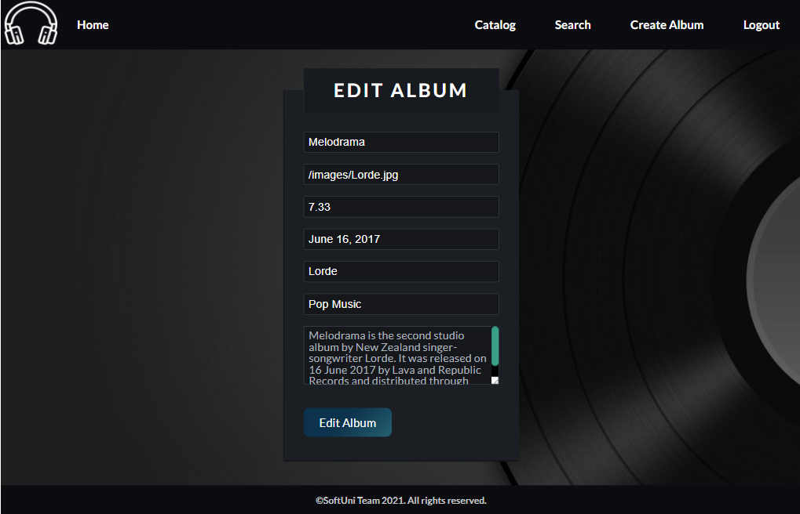

# Music App

1. Description

Music App is a front-end app (SPA) for viewing and managing albums. The application allows visitors to browse through different albums, including the author, genre and price of that album. Users can register and login with an email and password, which allows them to create their albums. Album creators can also edit or delete their posts at any time.

2. Application Specifications

### Navigation Bar

Navigation links will change the current page (view). The Home link will redirect to the Home page. Guests (un-authenticated visitors) can see the links to the Catalog page, the Login and Register pages. The logged-in user navbar will contain the links to the Catalog page, the Create page, and a link for e Logout action.

Guest navigation example:

User navigation example:

### Login User

The included REST service comes with the following premade user accounts, which may be used for development:

{ "email": "peter@abv.bg", "password": "123456" }

{ "email": "mary@abv.bg", "password": "123456" }

The Login page contains a form for existing user authentication. By providing an email and password, the app will login a user into the system if there are no empty fields.

If the login was successful the user will be redirected to the Home page. If there is an error, or the validations don't pass, an appropriate error message will be displayed, using a notification.

### Register User

The Register page contains a form for new user registration. By providing an email and password, the app will register a new user in the system if there are no empty fields.

If the registration was successful the user will be redirected to the Home page. If there is an error, or the validations don't pass, an appropriate error message will be displayed, using a notification.

### Logout

The logout action is available to logged-in users. If the logout was successful, the user will be redirected to the Home page.

### Catalog Page

This page displays a list of all the albums in the system, with their information. All users will be seeing albums, but only logged-in users will see the details button and the Details page.

Clicking on any of the cards details button leads to the details page for the selected album.

If there are no albums, the following view will be displayed:

### Home Page

All users will be greeted from the homepage. There is a static page. 

### Create Album Page

The Create page is available to logged-in users. It contains a form for creating new albums. All the fields are requiered for creation.

### Album Details

Users will be able to view details about albums. Clicking the Details link in of an album will display the Details page. If the currently logged-in user is the creator of the album, the Edit and Delete buttons will be displayed.

### Edit Album Page

The Edit page is accessible to logged-in users and allows the author to edit their albums. Clicking on the Edit button will display the Edit page. It contains a form with input fields for all relevant properties. All fields must be filled in order to edit the album. The fields wil be filled in when the page is first loaded. Upon success, the user will be redirected to the Details page.

### Delete Album

The delete action is available to logged-in users, for albums they have created. When the author clicks on the Delete action on any of their albums, a confirmation dialog will be displayed. Upon confirming this dialog, the album will be deleted from the system. Upon success, the user will be redirected to the Catalog page.

### Search Page

The Search page allows both users and guests to filter albums by their album's name. It contains an input field and, upon submition, a list of all matching albums will be displayed. If the search field isn't filled, an alert message will be shown.

The details button will be visible if the user is logged in.

If there are no results, the following view will be displayed:

Using the Local REST Service
----------------------------

### Starting the Service

The REST service will be in a folder named "server". It has no dependencies and can be started by opening a terminal in its directory and executing "node server.js". If everything initializes correctly, you should see a message about the host address and port on which the service will respond to requests.

### Sending Requests

To send a request, use the hostname and port, shown in the initialization log and resource address and method as described in the application requirements. If data needs to be included in the request, it must be JSON-encoded, and the appropriate Content-Type header must be added. Similarly, if the service is to return data, it will be JSON-encoded. Note that some requests do not return a body and attempting to parse them will throw an exception. Read requests, as well as login and register requests do not require authentication. All other requests must be authenticated.

### Required Headers

To send data to the server, include a Content-Type header and encode the body as a JSON-string. To perform an authenticated request, include an X-Authorization header, set to the value of the session token, returned by an earlier login or register request.

### Server Response

Data response:

HTTP/1.1 200 OK
Access-Contrl-Allow-Origin: *
Content-Type: application/json
*{JSON-encoded response data}*

Empty response:

HTTP/1.1 204 No Content
Access-Contrl-Allow-Origin: *

Error response:

HTTP/1.1 400 Request Error
Access-Contrl-Allow-Origin: *
Content-Type: application/json
*{JSON-encoded error message}*

### More Information

You can find more details on the [GitHub repository of the service](https://github.com/softuni-practice-server/softuni-practice-server/blob/master/README.md).

Running the Test Suite
----------------------

### Project Setup

The tests require a web server to deliver the content of the application. There is a development web server included in the project scaffold, but you may use whatever server you are familiar with. Note that specialized tools like BrowserSync may interfere with the tests. To initialize the project with its dependencies, open a terminal in the folder, containing the file package.json and execute "npm install". Note that if you changed the section devDependencies of the project, the tests may not initialize properly.

### Executing the Tests

Before running the test suite, make sure a web server is operational, and the application can be found at the root of its network address. To start the included dev-server, open a terminal in the folder containing package.json and execute "npm run start". This is a one-time operation unless you terminate the server at any point. It can be restarted with the same command as above.

To execute the tests, open a new terminal (do not close the terminal, running the web server instance) in the folder containing package.json and execute "npm test".

Test results will be displayed in the terminal, along with detailed information about encountered problems. You can perform this operation as many times as it is necessary by re-running the above command.

- Copyright @ SOFTUNI, Software University Bulgaria
