# Online Books Library

1. Description

Online Books Library is a front-end app (SPA) for viewing and managing books. The application allows visitors to browse through the books catalog. Users may register with an email and password, which allows them to create their own posts. Post authors can also edit or delete their own publications at any time.

2. Application Specifications

### Navigation Bar

A Navigation Bar changes the current screen (view). Guests (un-authenticated visitors) can see the links to the Dashboard page, as well as the links to the Login and Register pages. The logged-in user navbar contains the links to the Dashboard page, the My Books page, the Add Book page, Welcome, { user's email address } and a link for the Logout action.

User navigation example:

Guest navigation example:

### Login User

The included REST service comes with the following premade user accounts, which may be used for development:

{ "email": "peter@abv.bg", "password": "123456" }

{ "email": "john@abv.bg", "password": "123456" }

The Login page contains a form for existing user authentication. By providing an email and password the app should login a user in the system if there are no empty fields.

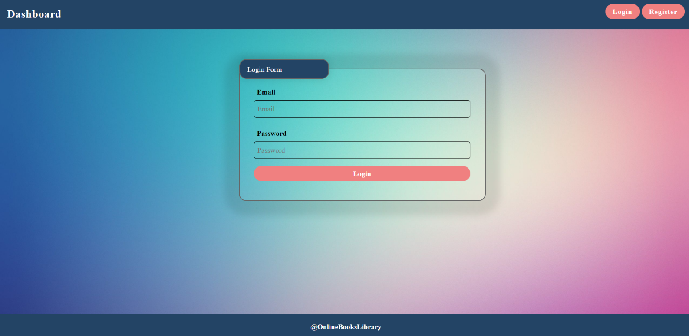

If the login was successful the user will be redirected to the Dashboard page. If there is an error, or the validations don't pass, an appropriate error message will be displayed, using a system dialog.

### Register User

By given email and password, the app registeres a new user in the system. All fields are required -- if any of them are empty, a system dialog will be displayed.

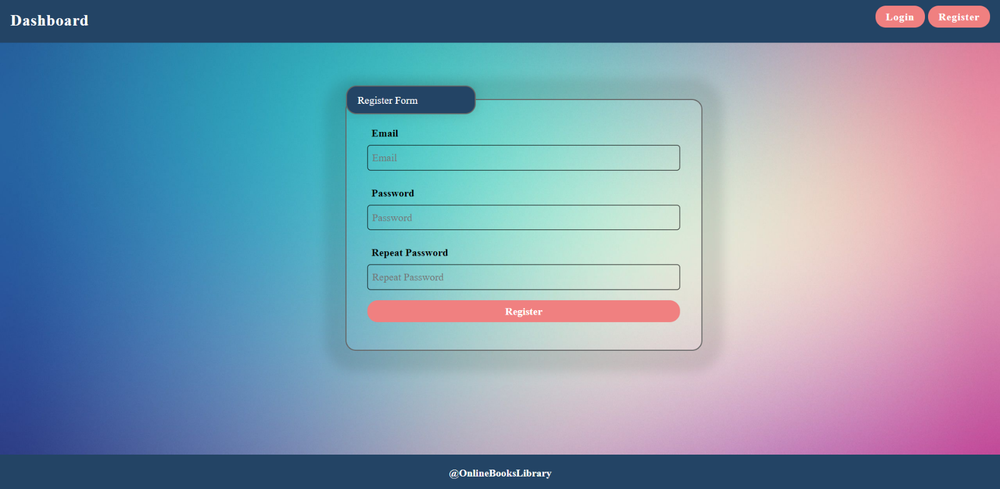

If the registration was successful the user will be redirected to the Dashboard page. If there is an error, or the validations don't pass, an appropriate error message will be displayed, using a system dialog.

### Logout

The logout action is available to logged-in users. If the logout was successful, the user will be redirected to the Dashboard page.

### Add Book Screen

The Create page is available to logged-in users. It contains a form for adding a new book. All fields must be filled in order to create a new book.

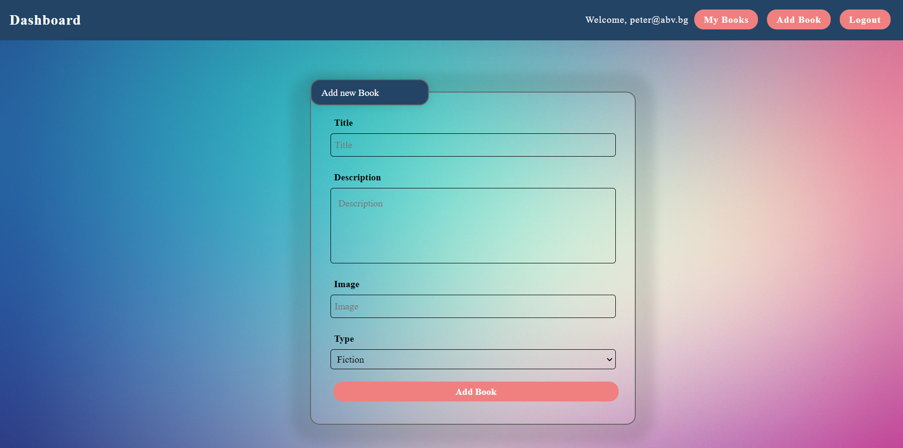

### Dashboard

This page displays a list of all the books in the system. Clicking on the details button in the cards leads to the details page for the selected book. This page is visible to guests and logged-in users.

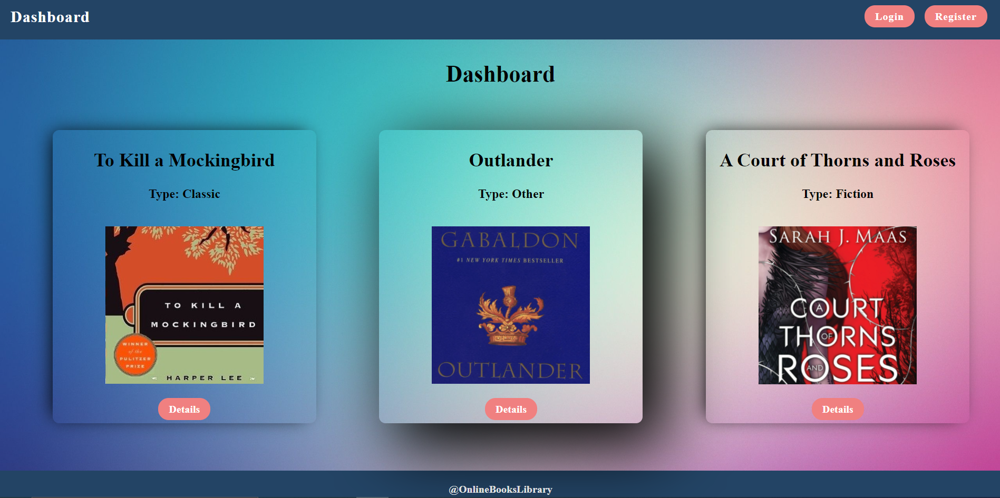

If there are no books, the following view will be displayed:

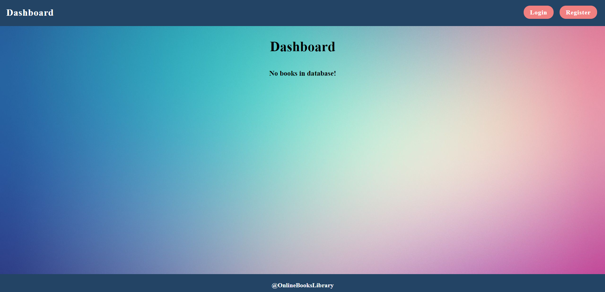

### Book Details

All users are able to view the details about a book. Clicking the Details link of a book card will display the Details page of that book. If the currently logged-in user is the creator of the book, the Edit and Delete buttons will be displayed, otherwise they will not be available. The view for the creators should look like:

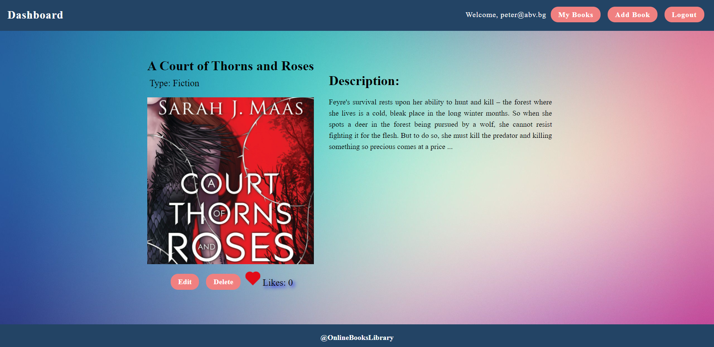

The view for guests should look like:

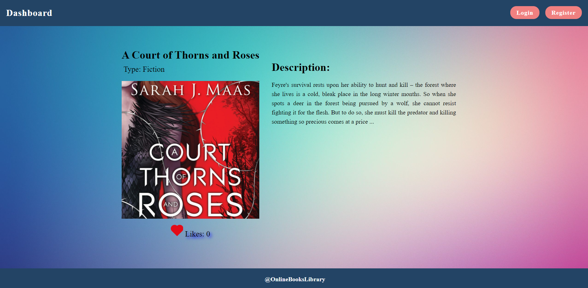

### Edit Book Screen

The Edit page is available to logged-in users and it allows authors to edit their own books. Clicking the Edit link of a particular book on the Details page will display the Edit page, with all fields filled with the data for that book. It contains a form with input fields for all relevant properties. All fields must be filled in order to edit the book.

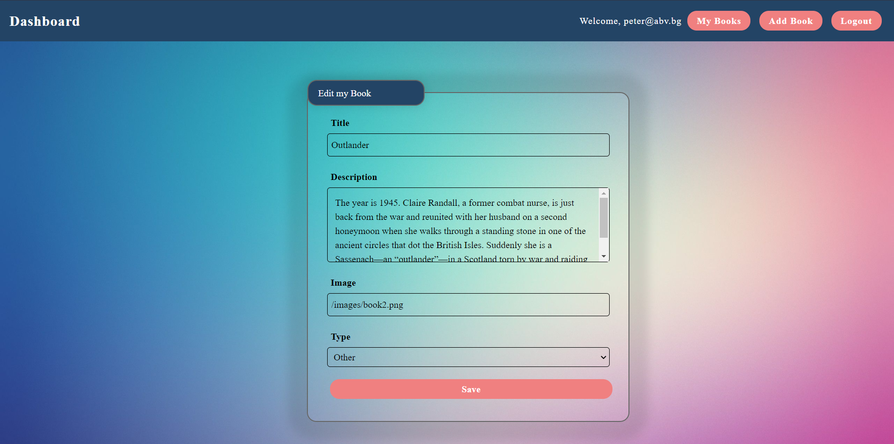

### Delete Book

The delete action is available to logged-in users, for books they have created. When the author clicks on the Delete action on any of their books, a confirmation dialog will be displayed. Upon confirming this dialog, the book will be deleted from the system. Upon success, the user will be redirected to the Dashboard page.

### My Books

Each logged-in user will be able to view his own books by clicking [My Books]. Al books added by the user will be shown.

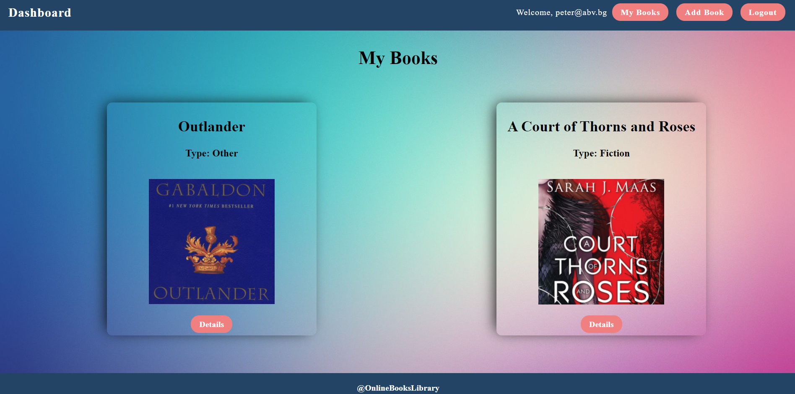

If there are no books, the following view will be displayed:

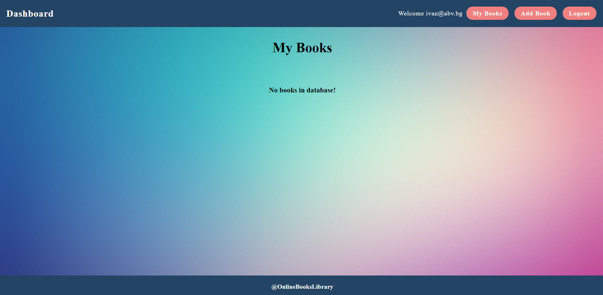

### Find Book

For logged-in users an additional field will be visible. Upon clicking the Find Book field a search field will appear, where the user can search a book in the library bt it's title or parts of a book title. 

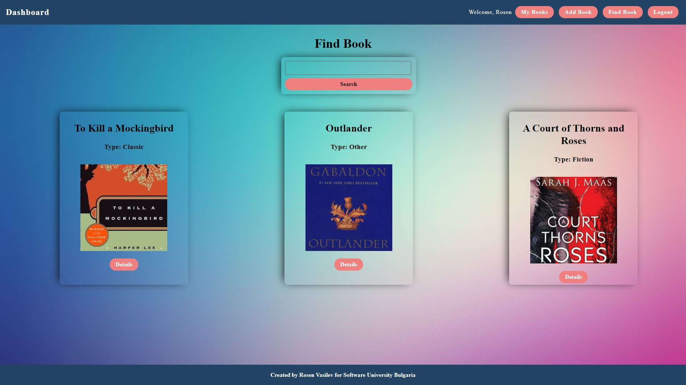

### Liking a book

Every logged-in user will be able to like other books, but not his own. By clicking on the [ Like ] button, the counter of each book increases by 1. The view when the user did not press [ Like ] button should look like:

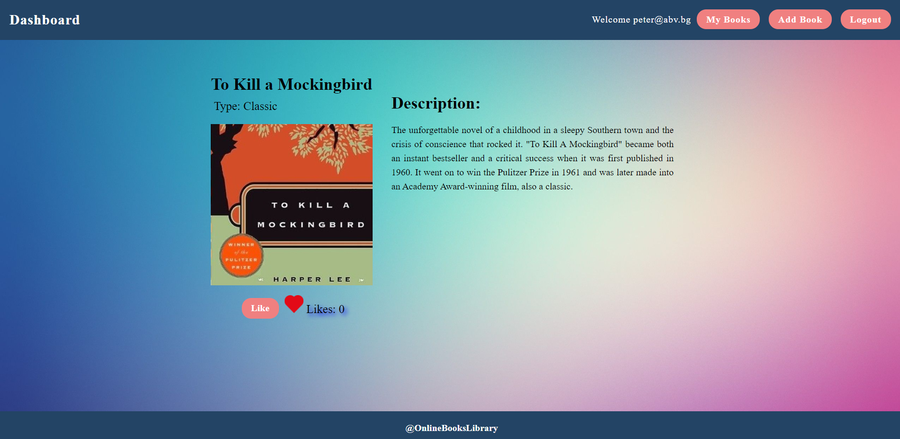

When the user Liked the book the [ Like ] button should not be available and the counter should be increased by 1. The creator should not be able to see the [ Like ] button. The view should look like:

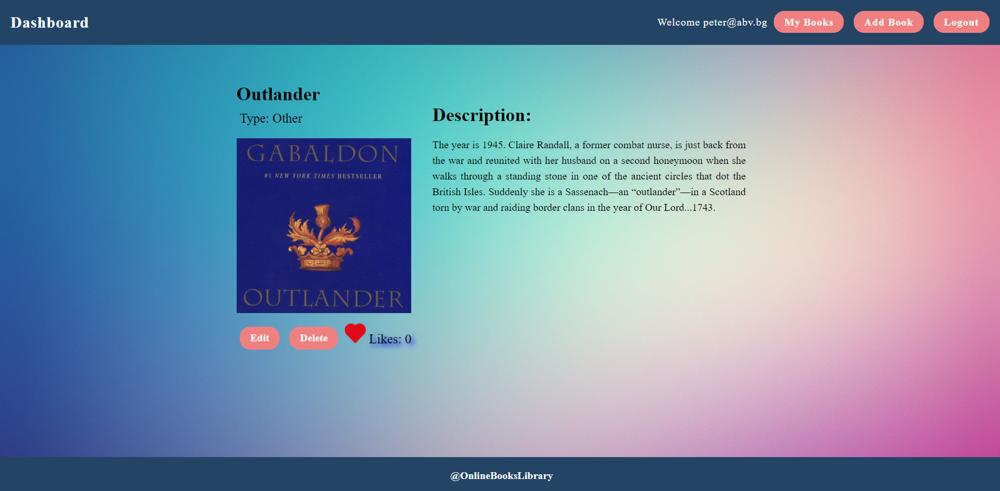

Guest should not be able to see the [ Like ] button. The view for guests should look like:

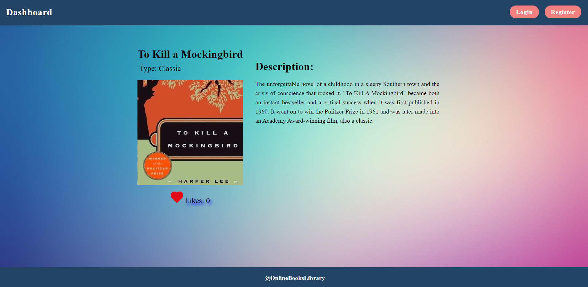

Using the Local REST Service
----------------------------

### Starting the Service

The REST service will be in a folder named "server". It has no dependencies and can be started by opening a terminal in its directory and executing "node server.js". If everything initializes correctly, you should see a message about the host address and port on which the service will respond to requests.

### Sending Requests

To send a request, use the hostname and port, shown in the initialization log and resource address and method as described in the application requirements. If data needs to be included in the request, it must be JSON-encoded, and the appropriate Content-Type header must be added. Similarly, if the service is to return data, it will be JSON-encoded. Note that some requests do not return a body and attempting to parse them will throw an exception. Read requests, as well as login and register requests do not require authentication. All other requests must be authenticated.

### Required Headers

To send data to the server, include a Content-Type header and encode the body as a JSON-string. To perform an authenticated request, include an X-Authorization header, set to the value of the session token, returned by an earlier login or register request.

### Server Response

Data response:

HTTP/1.1 200 OK
Access-Contrl-Allow-Origin: *
Content-Type: application/json
*{JSON-encoded response data}*

Empty response:

HTTP/1.1 204 No Content
Access-Contrl-Allow-Origin: *

Error response:

HTTP/1.1 400 Request Error
Access-Contrl-Allow-Origin: *
Content-Type: application/json
*{JSON-encoded error message}*

### More Information

You can find more details on the [GitHub repository of the service](https://github.com/softuni-practice-server/softuni-practice-server/blob/master/README.md).

Running the Test Suite
----------------------

### Project Setup

The tests require a web server to deliver the content of the application. There is a development web server included in the project scaffold, but you may use whatever server you are familiar with. Note that specialized tools like BrowserSync may interfere with the tests. To initialize the project with its dependencies, open a terminal in the folder, containing the file package.json and execute "npm install". Note that if you changed the section devDependencies of the project, the tests may not initialize properly.

### Executing the Tests

Before running the test suite, make sure a web server is operational, and the application can be found at the root of its network address. To start the included dev-server, open a terminal in the folder containing package.json and execute "npm run start". This is a one-time operation unless you terminate the server at any point. It can be restarted with the same command as above.

To execute the tests, open a new terminal (do not close the terminal, running the web server instance) in the folder containing package.json and execute "npm test".

Test results will be displayed in the terminal, along with detailed information about encountered problems. You can perform this operation as many times as it is necessary by re-running the above command.

- Copyright @ SOFTUNI, Software University Bulgaria
